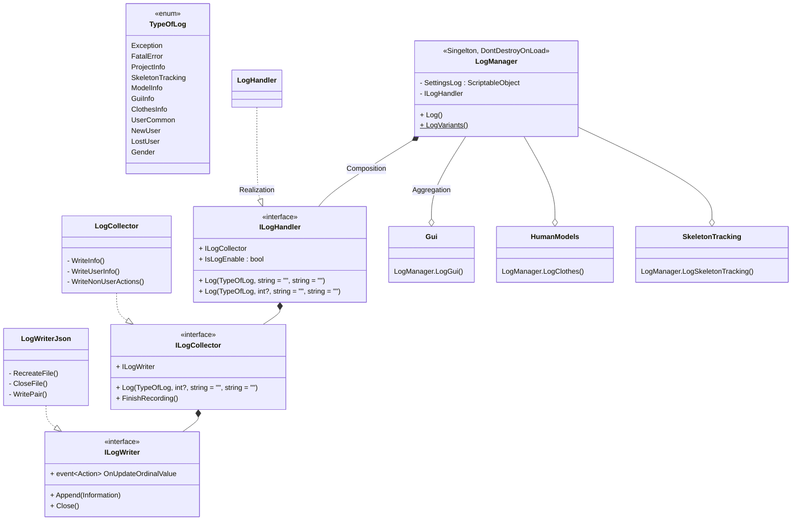

# Сбор и запись статистики о работе приложения и взаимодействии пользователей с системой

## Общие сведения
Вся логика сбора и записи информации содержится в модуле *CommonLibrary*. Любой модуль, имеющий в своей сборке ссылку на *CommonLibrary*, может вызывать функции логгирования. Компонент `LogManager` является синглтоном, который сохраняется при переходе между сценами. Он должен быть предварительно добавлен на сцену из префаба **LogManager.prefab**, например, на сцену инициализации.
К каждой записи автоматически добавляется время вызова. `ILogCollector` определяет формат записи даты и времени.
Новый файл создается каждый раз, когда приложение перезапускается, а также во время наступления следующего дня. Исходные значения id пользователей преобразуются в порядковые номера.
Модуль учитывает логику использования отрицальных id для непользовательских действий и записывает их отдельно, сохраняя id.
Запись осуществляется в виде двух типов: 
- общая информация, не зависящая от пользователя (`CommonInformation`);
- информаиция о сессии пользователя, если передано значение id, отличное от null (`UserInformation`), запись выполняется по завершении сессии (событие потери пользователя).

## Примеры использования
using Common;
- LogManager.Log(TypeOfLog.Gender, 1);
- LogManager.Log(TypeOfLog.GuiInfo, "nextButton", 1);
- LogManager.Log(TypeOfLog.ClothesInfo, "texture_name_1_A");
- LogManager.Log(TypeOfLog.ClothesInfo, "clothes_type", "texture_name_2_A");
- LogManager.LogNewUser(new ID(3));
- LogManager.LogGui("menuButton", 1);
- LogManager.LogException("exeption :: ex text");
- LogManager.LogFatalError("fatalerror :: err text");
- LogManager.LogGender("male", 1);
- LogManager.LogModel("model joint is null", 2);
- LogManager.LogProject("customer information");
- LogManager.LogProject("camera not supported");
- LogManager.LogSkeletonTracking("skeleron info");

## TODO
Добавить возможность отключать запись выбранных типов информации через настройки.

## Структура системы в виде диаграммы **Mermaid**

Компонент `LogManager` выступает оберткой со статическими методами для реализаций интерфейса `ILogHandler`. Из `ILogHandler` лог передается для накопления и сортировки в `ILogCollector`, после чего происходит запись с помощью `ILogWriter`.

